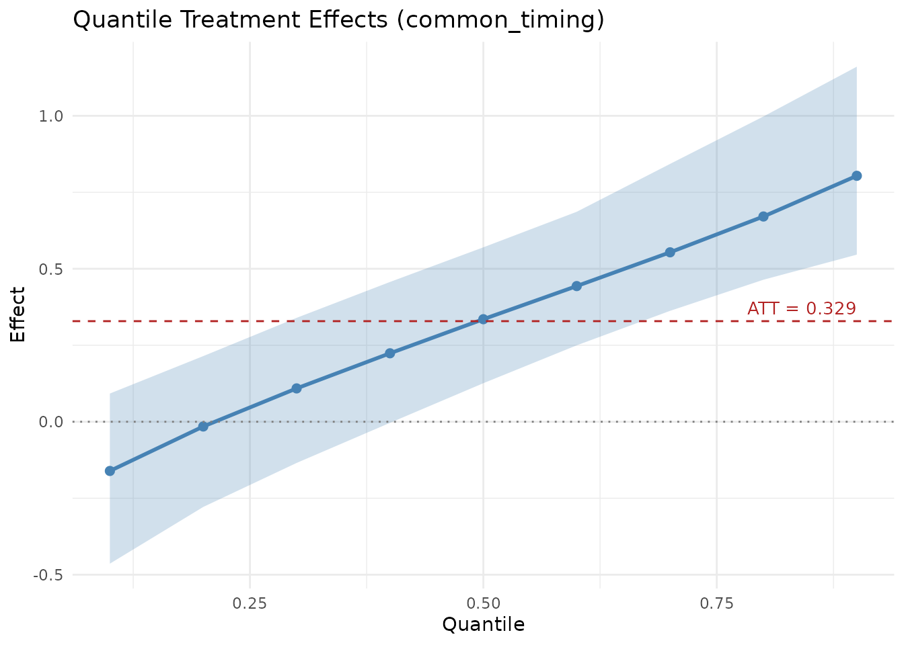
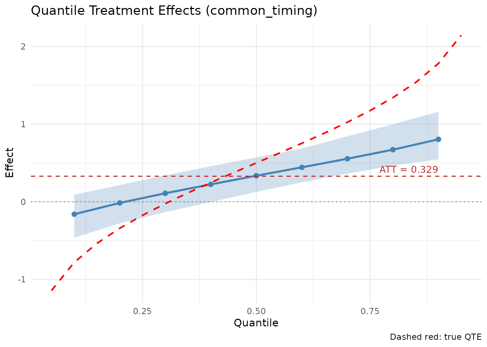

# Comparing endid and lwdidR

Both `endid` and `lwdidR` implement the panel Difference-in-Differences
(DiD) approach proposed by Lee & Wooldridge (2025). The core idea is to
perform unit-specific pre-treatment transformations (like demeaning or
detrending) and then collapse the panel into a cross-section for
estimation.

## Key Differences

| Feature | `lwdidR` | `endid` |
|:---|:---|:---|
| **Estimation** | Ordinary Least Squares (OLS) | Engression (Neural Network) |
| **Main Target** | Average Treatment Effect (ATT) | ATT and Distributional Effects (QTE) |
| **Inference** | Analytical SEs, Wild Bootstrap, Permutation | Non-parametric Unit Bootstrap |
| **Non-linearity** | Linear only | Handles complex non-linearities |

## A Simulation Comparison

We’ll simulate a panel where the treatment has a **location-scale**
effect: it shifts both the mean and the spread of the outcome
distribution. This creates quantile treatment effects (QTEs) that vary
across the distribution — small or even negative at lower quantiles, and
large at upper quantiles.

The true QTE at quantile $`\tau`$ is:
``` math
\text{QTE}(\tau) = \delta + (\sigma_1 - \sigma_0) \cdot \Phi^{-1}(\tau)
```
where $`\delta = 0.5`$ is the location shift, $`\sigma_0 = 0.5`$ and
$`\sigma_1 = 1.5`$, so $`\text{QTE}(\tau) = 0.5 + \Phi^{-1}(\tau)`$.
This ranges from about $`-0.78`$ at $`\tau = 0.1`$ to $`1.78`$ at
$`\tau = 0.9`$.

``` r

library(lwdidR)
library(endid)
#> 
#> Attaching package: 'endid'
#> The following object is masked from 'package:lwdidR':
#> 
#>     apply_transform
set.seed(42)

# Generate synthetic panel data with location-scale treatment effect
N <- 200
T_total <- 6
tpost1 <- 4

unit <- rep(1:N, each = T_total)
time <- rep(1:T_total, times = N)
alpha <- rep(rnorm(N, sd = 0.3), each = T_total)  # Unit fixed effects
# Group 1: treated, Group 0: control
group <- rep(c(1, 0), each = N/2 * T_total)
post <- as.integer(time >= tpost1)
D <- post * (group == 1)

# Location-scale DGP: treatment shifts mean by 0.5 and increases SD from 0.5 to 1.5
epsilon <- rnorm(N * T_total)
y <- alpha + 0.5 * D + (0.5 + 1.0 * D) * epsilon

df <- data.frame(unit = unit, time = time, y = y,
                 post_treat = D, group = group)
```

### 1. Estimating with lwdidR (OLS)

`lwdidR` estimates the Average Treatment Effect using OLS.

``` r

# Using 'post_treat' as the treatment receipt indicator
fit_lwdid <- lwdid(df, y = "y", ivar = "unit", tvar = "time", post = "post_treat",
                   vce = "hc3")
summary(fit_lwdid)
#> 
#> Lee-Wooldridge DiD (lwdidR)
#> Design:      common_timing
#> Transf.:     demean
#> VCE:         HC3
#> --------------------------------------------------
#> ATT:           0.3559
#> SE:            0.0972
#> t-stat:        3.6598
#> p-value:       0.0003
#> 95% CI:      [0.1641, 0.5477]
#> N (firstpost): 200
#> 
#> 
#> Period-specific effects:
#>  tindex    att     se tstat   pvalue
#>       4 0.4487 0.1642 2.733 0.006845
#>       5 0.3278 0.1642 1.997 0.047194
#>       6 0.2912 0.1601 1.819 0.070414
```

### 2. Estimating with endid (Engression)

`endid` uses `engression` to capture the distributional nature of the
effect.

``` r

# We use fewer epochs and bootstrap draws for speed in this vignette
# For endid, 'post' is a calendar indicator, 'dvar' is the group indicator
fit_endid <- endid(df, y = "y", ivar = "unit", tvar = "time",
                   post = "post_treat", dvar = "group",
                   num_epochs = 500, nboot = 20, silent = TRUE)
```

``` r

summary(fit_endid)
#> Engression-Based Distributional DiD
#> Design: common_timing | Transformation: demean
#> 
#> --- ATT ---
#>   Estimate        SE  CI_Lower  CI_Upper
#>  0.3287913 0.1187768 0.1370315 0.5529484
#> 
#> --- QTE ---
#>  quantile     effect        se     ci_lower   ci_upper
#>       0.1 -0.1608453 0.1629803 -0.463837016 0.09222215
#>       0.2 -0.0154868 0.1447135 -0.278476569 0.21458413
#>       0.3  0.1089925 0.1320758 -0.134654291 0.33962879
#>       0.4  0.2237623 0.1247939 -0.003577585 0.45690563
#>       0.5  0.3351900 0.1234901  0.126001726 0.57011401
#>       0.6  0.4434574 0.1271108  0.249755643 0.68627059
#>       0.7  0.5538159 0.1358760  0.362520146 0.84279969
#>       0.8  0.6708883 0.1500234  0.464175446 0.99783601
#>       0.9  0.8039002 0.1690881  0.546221603 1.16063045
```

### Visualizing Quantile Treatment Effects

While `lwdidR` provides a single ATT (around 0.5, the true location
shift), `endid` reveals the full picture: the treatment *hurts* at low
quantiles (by increasing downside risk) and *helps substantially* at
high quantiles (by increasing upside). The QTE plot should show an
upward-sloping curve crossing the ATT line.

``` r

library(ggplot2)
plot(fit_endid)
```


### Adding the True QTE

We can overlay the analytical QTE to verify that `endid` recovers the
true distributional effect.

``` r

# True QTE: 0.5 + qnorm(tau)
taus <- seq(0.05, 0.95, by = 0.05)
true_qte <- data.frame(tau = taus, qte = 0.5 + qnorm(taus))

plot(fit_endid) +
  geom_line(data = true_qte, aes(x = tau, y = qte),
            linetype = "dashed", color = "red", linewidth = 0.8) +
  labs(caption = "Dashed red: true QTE")
```



## When to use which?

1.  **Use `lwdidR`** when you want a fast, industry-standard linear DiD
    estimate with well-understood frequentist properties and
    high-performance standard errors (like Wild Cluster Bootstrap).
2.  **Use `endid`** when you suspect the treatment effect might be
    non-linear, vary across the distribution, or if you want to estimate
    Quantile Treatment Effects (QTE). In this example, `lwdidR`
    correctly estimates the ATT of 0.5, but completely misses that the
    treatment *increases inequality* — a conclusion only visible through
    the distributional lens of `endid`.
