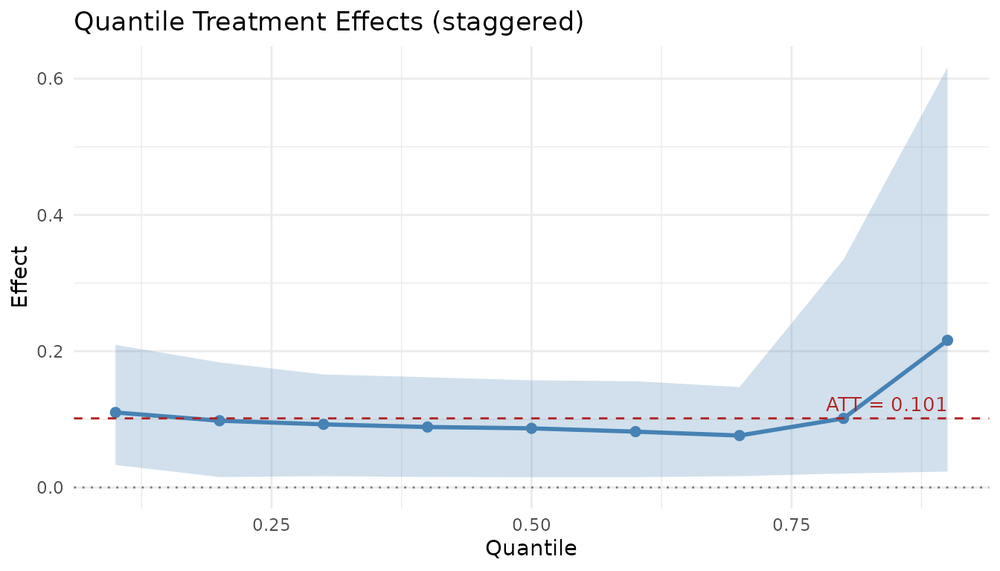

# Real Data Example: Castle Doctrine

In this vignette, we compare `lwdidR` and `endid` using the “Castle
Doctrine” dataset from Cheng and Hoekstra (2013). States adopted castle
doctrine laws in different years (2005–2009), making this a staggered
adoption design.

## Data Preparation

We load the data and set up the treatment timing variable (`gvar`).
States that never adopted the law during the sample period serve as
controls.

``` r

library(lwdidR)
library(endid)
#> 
#> Attaching package: 'endid'
#> The following object is masked from 'package:lwdidR':
#> 
#>     apply_transform
library(ggplot2)
set.seed(42)

# Load the Castle Doctrine dataset
castle <- read.csv(system.file("extdata", "castle.csv", package = "lwdidR"))

# Create gvar: first treatment year (NA for never-treated)
castle$gvar <- castle$effyear
castle$gvar[is.na(castle$gvar) | castle$gvar == 0] <- NA

# Time-invariant controls
controls <- c("poverty", "unemployrt", "blackm_15_24", "whitem_15_24")

cat("States by cohort:\n")
#> States by cohort:
print(table(castle$gvar[!duplicated(castle$sid)], useNA = "ifany"))
#> 
#> 2005 2006 2007 2008 2009 <NA> 
#>    1   13    4    2    1   29
```

## Linear Estimation with lwdidR

`lwdidR` provides a robust, linear estimate of the Average Treatment
Effect on the Treated (ATT) using the staggered design.

``` r

fit_lwdid <- lwdid(
  data = castle,
  y = "lhomicide",
  ivar = "sid",
  tvar = "year",
  gvar = "gvar",
  controls = controls,
  vce = "hc3"
)
#> Warning in prepare_controls(samp, d, controls): Controls not applied: N1=1,
#> N0=29, K+1=5. Controls ignored.
#> Warning in prepare_controls(samp, d, controls): Controls not applied: N1=1,
#> N0=29, K+1=5. Controls ignored.
#> Warning in prepare_controls(samp, d, controls): Controls not applied: N1=1,
#> N0=29, K+1=5. Controls ignored.
#> Warning in prepare_controls(samp, d, controls): Controls not applied: N1=1,
#> N0=29, K+1=5. Controls ignored.
#> Warning in prepare_controls(samp, d, controls): Controls not applied: N1=1,
#> N0=29, K+1=5. Controls ignored.
#> Warning in prepare_controls(samp, d, controls): Controls not applied: N1=1,
#> N0=29, K+1=5. Controls ignored.
#> Warning in prepare_controls(samp, d, controls): Controls not applied: N1=4,
#> N0=29, K+1=5. Controls ignored.
#> Warning in prepare_controls(samp, d, controls): Controls not applied: N1=4,
#> N0=29, K+1=5. Controls ignored.
#> Warning in prepare_controls(samp, d, controls): Controls not applied: N1=4,
#> N0=29, K+1=5. Controls ignored.
#> Warning in prepare_controls(samp, d, controls): Controls not applied: N1=4,
#> N0=29, K+1=5. Controls ignored.
#> Warning in prepare_controls(samp, d, controls): Controls not applied: N1=2,
#> N0=29, K+1=5. Controls ignored.
#> Warning in prepare_controls(samp, d, controls): Controls not applied: N1=2,
#> N0=29, K+1=5. Controls ignored.
#> Warning in prepare_controls(samp, d, controls): Controls not applied: N1=2,
#> N0=29, K+1=5. Controls ignored.
#> Warning in prepare_controls(samp, d, controls): Controls not applied: N1=1,
#> N0=29, K+1=5. Controls ignored.
#> Warning in prepare_controls(samp, d, controls): Controls not applied: N1=1,
#> N0=29, K+1=5. Controls ignored.
summary(fit_lwdid)
#> 
#> Lee-Wooldridge DiD (lwdidR)
#> Design:      staggered
#> Transf.:     demean
#> VCE:         HC3
#> --------------------------------------------------
#> Overall ATT:   0.0917
#> SE:            0.0612
#> t-stat:        1.4997
#> p-value:       0.1402
#> --------------------------------------------------
#> 
#> Cohort-specific effects:
#>  cohort     att      se tstat    pvalue
#>    2005 0.08017 0.03215 2.493 1.884e-02
#>    2006 0.06824 0.08920 0.765 4.488e-01
#>    2007 0.11406 0.09838 1.159 2.552e-01
#>    2008 0.14605 0.08203 1.780 8.548e-02
#>    2009 0.21108 0.03550 5.946 2.115e-06
#> 
#> 
#> (g, r)-specific effects (first 10 rows):
#>  cohort period event_time      att      se    pvalue
#>    2005   2005          0 -0.13318 0.02826 6.089e-05
#>    2005   2006          1  0.08609 0.03449 1.873e-02
#>    2005   2007          2  0.16398 0.04686 1.580e-03
#>    2005   2008          3  0.13671 0.05067 1.168e-02
#>    2005   2009          4  0.12836 0.04484 7.861e-03
#>    2005   2010          5  0.09904 0.04880 5.200e-02
#>    2006   2006          0  0.05482 0.11626 6.405e-01
#>    2006   2007          1  0.03590 0.18718 8.491e-01
#>    2006   2008          2  0.04571 0.09609 6.375e-01
#>    2006   2009          3 -0.01218 0.09328 8.970e-01
```

## Distributional Estimation with endid

`endid` uses engression to estimate how the law affects different parts
of the homicide rate distribution, aggregating across all treatment
cohorts.

``` r

# Reduced epochs and bootstrap for faster rendering
fit_endid <- endid(
  data = castle,
  y = "lhomicide",
  ivar = "sid",
  tvar = "year",
  gvar = "gvar",
  controls = controls,
  rolling = "demean",
  num_epochs = 500,
  nboot = 20,
  silent = TRUE
)
#> Warning in endid_staggered(data = data, y = y, ivar = ivar, tvar = tvar, :
#> Cohort 2005: skipping (n_treated=1, n_control=29).
#> Warning in endid_staggered(data = data, y = y, ivar = ivar, tvar = tvar, :
#> Cohort 2009: skipping (n_treated=1, n_control=29).
```

``` r

summary(fit_endid)
#> Engression-Based Distributional DiD
#> Design: staggered | Transformation: demean
#> 
#> --- ATT ---
#>   Estimate         SE   CI_Lower  CI_Upper
#>  0.1014574 0.05928187 0.04844647 0.2315257
#> 
#> --- QTE ---
#>  quantile     effect         se   ci_lower  ci_upper
#>       0.1 0.11008086 0.06281397 0.03305628 0.2092758
#>       0.2 0.09800152 0.05967277 0.01538266 0.1835884
#>       0.3 0.09267147 0.05131993 0.01656486 0.1659003
#>       0.4 0.08874064 0.04851881 0.01546646 0.1618019
#>       0.5 0.08679277 0.04417654 0.01513210 0.1572755
#>       0.6 0.08197644 0.04180593 0.01519707 0.1559740
#>       0.7 0.07624835 0.04142060 0.01661544 0.1474055
#>       0.8 0.10139028 0.10064137 0.02047468 0.3345670
#>       0.9 0.21599885 0.21765148 0.02326322 0.6167878
#> 
#> --- Cohort-level Results ---
#>  Cohort        ATT         SE    CI_Lower  CI_Upper N_Treated N_Control
#>    2006 0.05176516 0.06147103 -0.04839783 0.1627403        13        29
#>    2007 0.19898443 0.15554471  0.02218221 0.4764322         4        29
#>    2008 0.22940294 0.08525551  0.14186100 0.4148255         2        29
```

## Comparing the Results

While `lwdidR` provides a single point estimate (the average effect),
`endid` allows us to visualize the **Quantile Treatment Effects (QTE)**.

``` r

plot(fit_endid)
```



### Interpretation

In this example, `lwdidR` shows the average effect of castle doctrine
laws on log homicide rates. The `endid` results complement this by
showing how the effect varies across quantiles of the distribution. This
distributional perspective can be crucial for policy analysis where the
impact on the “tails” of the distribution is as important as the average
impact.
